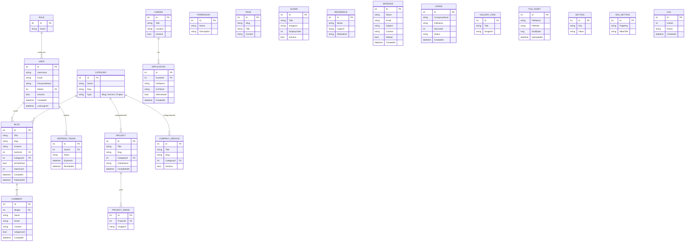

# ER Diyagramı

Backend'de tanımlı 21 tablo ve aralarındaki ilişkiler. GitHub bu diyagramı
otomatik render eder (Mermaid).

## Notlar

- `Offer.ServiceId` ve `Log.UserId` şu an plain `int` — henüz navigation property
  olarak bağlanmadı (ihtiyaç oldukça eklenecek).
- Gerçek veritabanı henüz kurulmadı; bu diyagram `BlogProject.API/Entities/`
  altındaki C# sınıflarından çıkarılmıştır, migration'lar oluşturulunca SQL
  şeması bununla birebir eşleşecektir.
